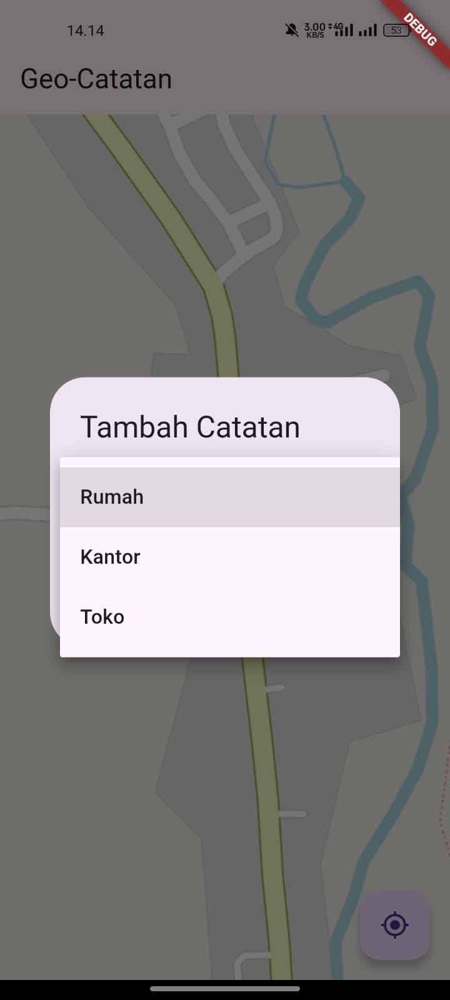
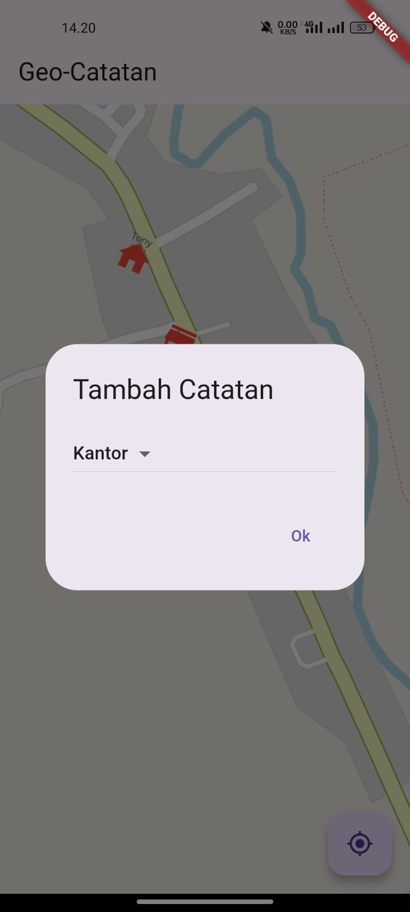
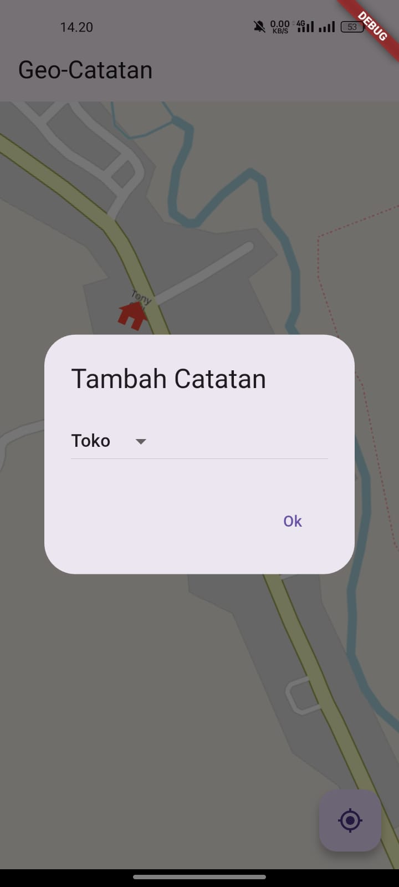
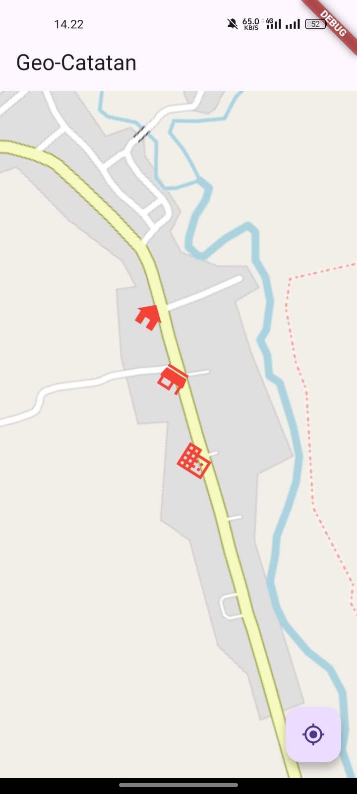
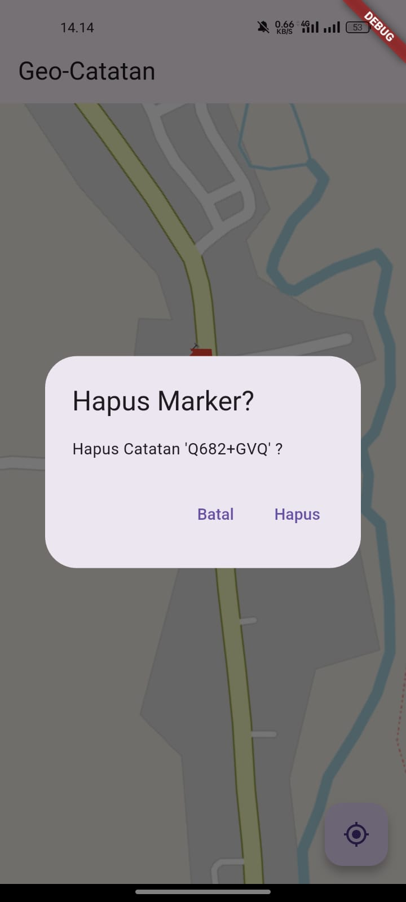
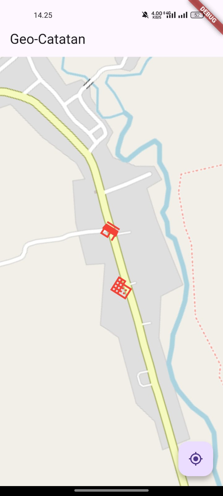

## FEBRIYAN PUTRA HARIADI
## 362458302042

# PRAKTIKUM GEO

- Menambahkan dependensi

````
dependencies:
  flutter:
    sdk: flutter
  #Paket-paket yang digunakan
  geolocator: ^11.0.0
  geocoding : ^3.0.0
  flutter_map: ^6.1.0
  latlong2: ^0.9.0
  shared_preferences: ^2.2.2
````

Digunakan untuk menambahkan package flutter_map, geolocator, geocoding, shared_preferences, dan latlong2 untuk mendukung fitur peta, GPS, alamat, dan penyimpanan data.

- Menambahkan pengaturan izin akses lokasi (Permission)
````
    <uses-permission android:name="android.permission.ACCESS_FINE_LOCATION" />
    <uses-permission android:name="android.permission.ACCESS_COARSE_LOCATION" />
    <uses-permission android:name="android.permission.INTERNET" />
    <application
````
Ditambahkan di:
android/app/src/main/AndroidManifest.xml
tepat di atas <application>, untuk meminta izin gps agar dapat membaca lokasi.

- Membuat Model Catatan

````
import 'package:latlong2/latlong.dart';

class CatatanModel {
  final LatLng position;
  final String note;
  final String address;

  CatatanModel({
    required this.position,
    required this.note,
    required this.address,
  });
}
````
Membuat CatatanModel yang berisi: posisi (latitude & Longitude), catatan, alamat, dan jenis marker. Model digunakan untuk menyimpan data marker.

## Tugas Praktikum

### 1. Kustomisasi Marker
````
  IconData getMarkerIcon(String type) {
    switch (type) {
      case "Rumah":
        return Icons.home;
      case "Kantor":
        return Icons.business;
      case "Toko":
        return Icons.store;
      default:
        return Icons.location_on;
    }
  }
````
Saat long press, user memilih jenis marker, dan ikon marker menyesuaikan.

### 2. Hapus Data Marker
````
                      onTap: () {
                        showDialog(
                          context: context,
                          builder: (_) => AlertDialog(
                            title: Text("Hapus Marker?"),
                            content: Text("Hapus Catatan '${n.address}' ?"),
                            actions: [
                              TextButton(
                                onPressed: () => Navigator.pop(context),
                                child: Text("Batal"),
                              ),
                              TextButton(
                                onPressed: () async {
                                  setState(() {
                                    _savedNotes.remove(n);
                                  });
                                  await saveNotes();
                                  Navigator.pop(context);
                                },
                                child: Text("Hapus"),
                              ),
                            ],
                          ),
                        );
                      },
````
Digunakan saat ingin menghapus marker dengan cara klik marker dan muncul dialog hapus

### 3. Simpan Data (Menggunakan SharedPreferences)

- Fungsi saveNotes (Menyimpan Marker) 
````
  //Simpan semua catatan ke SharedPreferences
  Future<void> saveNotes() async {
    final prefs = await SharedPreferences.getInstance();

    List<String> encoded = _savedNotes.map((note) {
      return jsonEncode({
        'latitude': note.position.latitude,
        'longitude': note.position.longitude,
        'note': note.note,
        'address': note.address,
        'type': note.type,
      });
    }).toList();

    await prefs.setStringList('catatan', encoded);
  }
````
Digunakan untuk mengubah semua marker (_savedNotes) menjadi JSON list, lalu disimpan ke SharedPreferences.

- Fungsi loadNotes (Memuat marker lama)
````
  //Muat semua catatan dari SharedPreferences
  Future<void> loadNotes() async {
    final prefs = await SharedPreferences.getInstance();
    List<String>? data = prefs.getStringList('catatan');

    if (data != null) {
      setState(() {
        _savedNotes.clear();
        for (var item in data) {
          var decoded = jsonDecode(item);
          _savedNotes.add(
            CatatanModel(
              position: latlong.LatLng(
                decoded['latitude'],
                decoded['longitude'],
              ),
              note: decoded['note'],
              address: decoded['address'],
              type: decoded['type'],
            ),
          );
        }
      });
    }
  }
````
Digunakan saat aplikasi start, semua data yang tersimpan di SharedPreferences diambil kembali dan dimasukkan ke _savedNotes.

- Panggil loadNotes() Saat Aplikasi Dibuka
````
  @override
  void initState() {
    super.initState();
    loadNotes();
  } 
````
Digunakan agar marker dari penyimpanan langsung muncul.

## Hasil Tampilan Aplikasi
- ### Menambahkan Catatan






- ### Hasil Menambahkan


- ### Hapus Catatan


